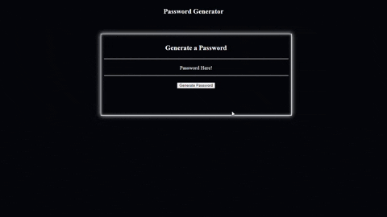

# PasswordGen
Here's an application that generates a random password based on user-selected criteria.

The user will be prompted to choose from the following password criteria: Length (must be between 8 and 128 characters), Special characters, Numeric characters, Lowercase characters, and Uppercase characters.

The application will validate if the user has put a numerical value between 8-128, if not it will stop and the user will have to click the button again to generate password.

The application will also validate that at least one character type is selected. If not it will stop and the user will have to click the button again to generate password.

Once all prompts are answered, the user will be presented with a password matching the answered prompts. The generated password will be displayed where the text reads: Password Here!

Here is an example of the application:

